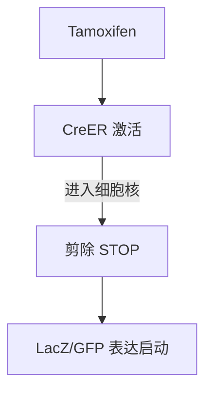
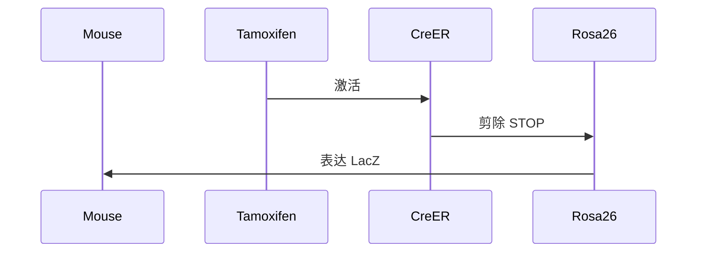
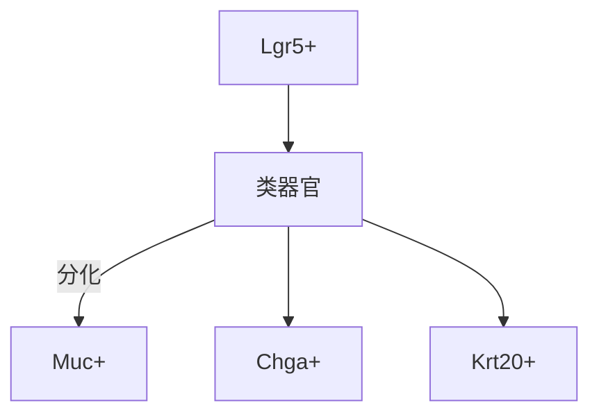
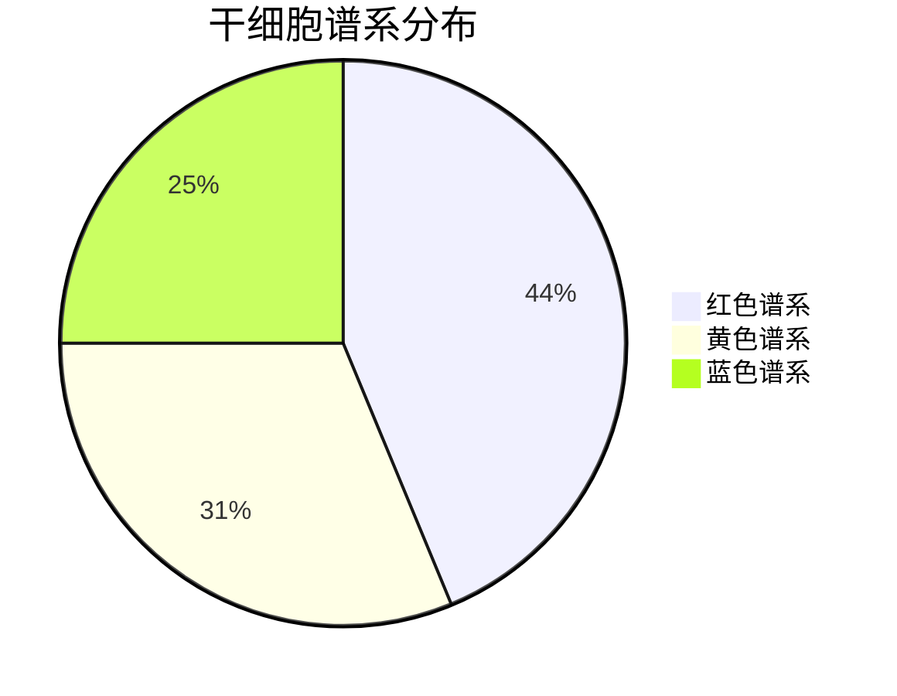

## 一、研究背景与目的

肠道上皮每 4–5 天更新一次，依赖隐窝底部的活跃干细胞（Lgr5⁺ CBCs）。为了研究这些干细胞的功能、分化轨迹和再生潜力，科学家建立了一套**可控、可视化、可遗传的谱系追踪系统**，实现对干细胞及其后代的精准标记与长期观察。

---

## 二、系统组成与分子原理

### 1. Lgr5-CreER：空间特异性 + 时间可控性

- **Lgr5** 是 Wnt 信号通路的靶基因，仅在隐窝底部的活跃干细胞中表达。
- **CreER** 是 Cre 酶与改造雌激素受体（ER）融合的蛋白，需 Tamoxifen 激活。
- 激活后进入细胞核，剪除 LoxP 位点间的 STOP 序列。

**机制图示：**



---

### 2. Rosa26-loxP-STOP-loxP-Reporter：安全插入 + 永久标记

**Rosa26原理详解：** 

- 位于小鼠第6号染色体，是一个**非编码但转录活跃的区域**。
- 插入点通常选在 **intron 1**，不会干扰原始基因功能。
- 插入结构如下：

```text
Rosa26 Exon1 ── Intron1 ── [loxP–STOP–loxP–LacZ] ── Exon2
```

- **STOP cassette**：含多个 polyA 信号和终止密码子，阻止下游 reporter 表达。
- **Cre 激活后**：STOP 被剪除，LacZ 开始表达，且在所有后代中持续存在。

**插入结构图示：**


---

### 3. Tamoxifen：诱导剂

- 激活 CreER，使其进入细胞核。
- 剪除 STOP 序列，启动 reporter 表达。
- 标记仅发生在注射时间点的 Lgr5⁺ 干细胞及其后代。

---

## 三、实验流程与逻辑

|步骤|操作说明|
|---|---|
|①|交配 Lgr5-CreER 与 Rosa26-LacZ 小鼠，获得双转基因个体|
|②|注射 Tamoxifen，激活 CreER 酶|
|③|CreER 剪除 STOP → LacZ 表达启动|
|④|所有被标记的干细胞及其后代可通过 X-gal 染色呈蓝色|

**流程图示：**



---

## 四、实验观察与结果解读

|条件|观察结果|
|---|---|
|无 Tamoxifen|CreER 不激活 → LacZ 不表达 → 无标记细胞|
|加 Tamoxifen|CreER 激活 → LacZ 表达 → 蓝色干细胞及后代可见|

---

## 五、系统优势与应用拓展

### 应用方向：

- **干细胞功能验证**：是否能分化为所有肠道细胞类型（多能性）
- **再生能力研究**：损伤后是否能恢复干细胞功能
- **癌变机制探索**：如 APC 缺失 → β-catenin 积累 → 干细胞异常增殖
- **类器官构建**：单个 Lgr5⁺ 干细胞培养“迷你肠”
- **多色谱系追踪**：Rosa-Confetti 小鼠标记不同干细胞谱系
- **可塑性研究**：Alpi⁺ 分化细胞可回归 Lgr5⁺ 干细胞状态

**类器官图示：**



---

## 六、Rosa-Confetti 扩展机制

- 插入多色 reporter（GFP、RFP、YFP、CFP）
- 每个干细胞随机表达一种颜色
- 可观察干细胞之间的空间竞争与替代

**竞争示意图：**



---

## 七、结论

通过 Lgr5-CreER × Rosa26-loxP-STOP-loxP-Reporter 的组合，科学家构建了一套**精准、可控、永久的谱系追踪系统**，为肠道干细胞的研究提供了强有力的遗传工具。该系统不仅揭示了干细胞的多能性和再生潜力，也为类器官构建、疾病建模和再生医学奠定了基础。
