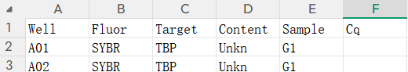

> Mynx，用 Tauri 2 + React + Rust 构建的桌面工具。支持 Windows 和 macOS（Apple Silicon）。

## 名字的由来

Mynx 取自 **Lynx（猞猁）**——敏捷、轻盈的野生猫科动物。L 换成 M，一是 "My" 的谐音，"我的工具"；二是希望它像猞猁一样轻快。

## 为什么不用 Electron

最初用 **Electron**。生态成熟、上手快，但体积太大——一个简单工具打包后 150MB+，处理 Excel 和图片转换这种轻量需求性价比太低。

后来转向 **Tauri**。系统自带 WebView（Windows 上是 WebView2，macOS 上是 WebKit），后端 Rust，前端照旧 React。同样的功能打包后十几 MB，**体积缩小近十倍**，Rust 后端在文件操作上性能也更好。对于"偶尔用一下"的工具，一个 5MB 的安装包和 150MB 的安装包，感受完全不同。

## 功能一：qPCR 数据分析

### 解决的问题

qPCR 实验结束后仪器导出长格式 Excel，每行一个测量值需要：pivot 成宽格式矩阵、用 2^-(ΔCt) 或 2^-(ΔΔCt) 计算相对表达量、每个基因生成带误差棒的柱状图。

### 从宏命令到纯 XML 实现

qPCR 计算最初用 **Excel 宏命令（VBA）** 实现（[旧方案记录](https://www.fanguanghan.homes/blog/2025/20251001)）。但有缺陷：

- **平台受限**：VBA 宏只在 Windows + Excel 下可用，macOS 支持不完整
- **太慢**：Tauri 中通过 VBS 脚本间接调用 Excel COM，每次启动一个 Excel 进程，单个文件几十秒
- **不稳定**：COM 操作图表时经常崩溃

后来彻底抛弃 Excel COM，用 **纯 JS 直接操作 OOXML** 生成图表。`.xlsx` 本质是 ZIP 包，里面是 XML。Mynx 用 ExcelJS 读写数据，保存后用 JSZip 重新打开 ZIP，直接注入 `chart.xml`、`drawing.xml` 等图表定义，再重新打包。**跨平台、零 Excel 依赖、毫秒级出图**，效果与原 VBA 宏一致。

### 为什么执着于 Excel

因为**这个功能就是为方便快速预览数据而生的**。科研工作流里 Excel 最通用，Mynx 生成的文件双击就开，图表已嵌入。

同时生成 **`Summary_All_Genes`** 汇总 sheet，所有基因分组数据整理成一张干净表格。需要 violin plot、heatmap 等高级可视化，可以拿这张表的数据给 R 或 Python。Mynx 不替代统计工具，只负责把原始数据收拾干净。

### 计算方法

支持两种：**相对内参**（RE = 2^-(Ct_target - Ct_ref)）和**相对对照/ΔΔCt**（以对照组为基准）。可选重复次数（1-10）、内参基因、图表颜色，每个基因生成独立 sheet（含原始值、平均值、标准差）+ 汇总 sheet + 嵌入柱状图。

### 详细使用教程

> 将数据整理成这种格式：
>
> 
>
> 然后参照如下：
>
> 

## 功能二：TIFF 转 JPG

### 使用场景

科研成像（显微镜照片等）常用 TIFF，画质好但一张几十 MB。做 PPT 时需要压缩为 JPG 并加水印标注文件名。

配合 [SlideSCI](https://github.com/Achuan-2/SlideSCI) 用效果最好——SlideSCI 从幻灯片批量提取图片，Mynx 把 TIFF 批量转为带水印的 JPG，直接往文档里贴。

### 实现细节

跨平台实现因平台而异：

- **Windows**：PowerShell + .NET `System.Drawing`，UTF-8 BOM 确保中文字体名正确
- **macOS**：系统自带 `sips`，回退 ImageMagick（水印需要，未装则跳过并提示）

水印选项：6 种字体、6 档字号、粗体/斜体、边距、背景透明度（4 档）、JPG 质量（5 档）。批量处理整个文件夹，输出到带时间戳的子目录，实时进度。

### 详细使用教程

> 待补充。将涵盖文件夹选择、水印选项、JPG 质量设置、多页 TIFF 处理、输出目录说明等。

## 界面与体验

- **自定义标题栏**：支持置顶，macOS 控件自动左移
- **侧边栏**：图标式导航，底部入口：网站、主题、关于
- **三套主题**：跟随系统、深色（石墨）、浅色（珍珠），选择器有实时预览
- **天气小组件**：IP 定位 + Open-Meteo，无需 API key，30 分钟缓存
- **自动更新**：启动后静默检查，支持进度显示
- **拖拽导入**：选文件和选文件夹都支持拖拽

## 技术栈

| 层级 | 技术 |
|---|---|
| 前端 | React 18 + TypeScript + Vite |
| 后端 | Rust + Tauri 2 |
| Excel | ExcelJS + JSZip（OOXML 图表注入）|
| TIFF | .NET System.Drawing（Win）/ sips + ImageMagick（mac）|
| 安装器 | 独立 Tauri 2 应用 |
| CI/CD | GitHub Actions，Win + mac 并行构建 |

## 写在最后

Mynx 在每个技术决策上都选了"更麻烦但更好"的路：放弃 Electron 转 Tauri 换来十倍体积优势，放弃 VBA 宏用纯 XML 重写换来跨平台和性能，放弃 NSIS 自建安装器换来体验控制。出发点很简单：**工具应该轻量、快速、跨平台**。

代码开源在 [GitHub](https://github.com/hanhan124/mynx)。
